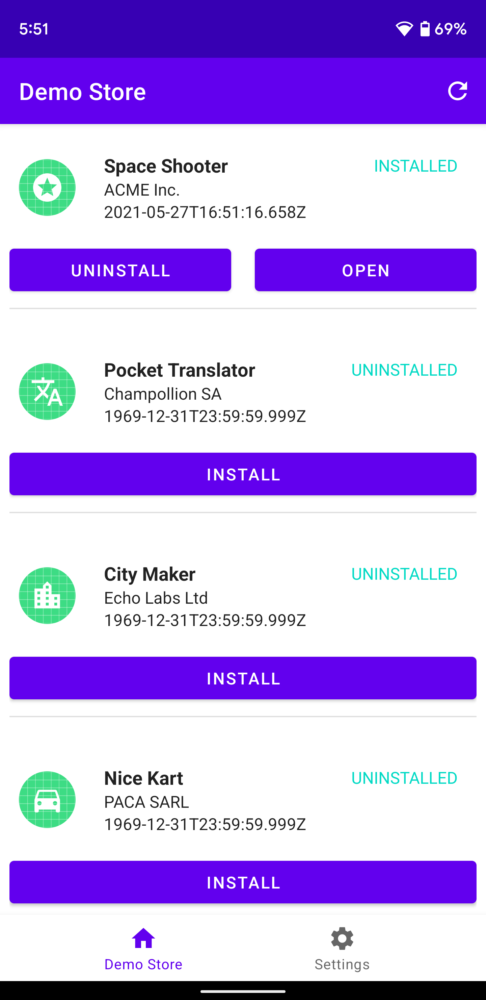
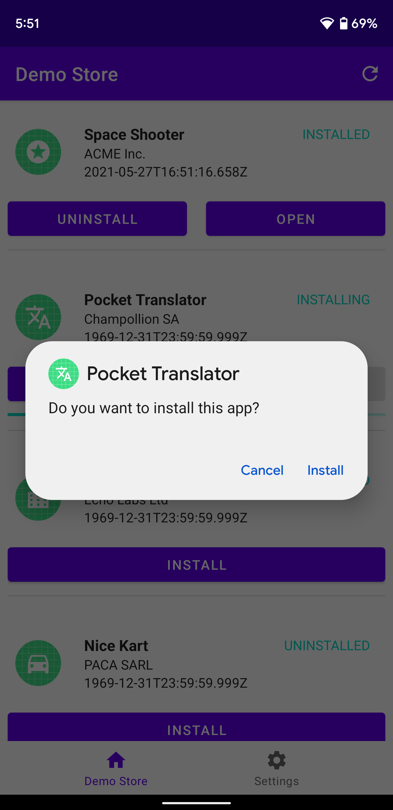
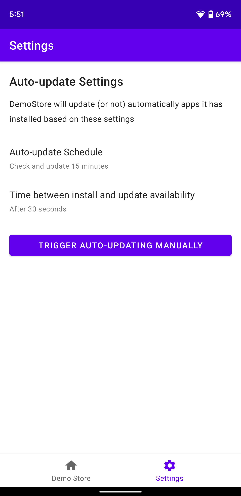

# Package Installer sample

This sample demonstrates how to use the Package Installer API to install, upgrade and delete apps on
Android S+ devices.

## TODO
- Manual refresh button ✅
- Show lastUpdateTime in the Library ✅
- Fix upgrade ✅
- Listen to PACKAGE_ADDED ✅
- Fix library refresh ✅
- Fix notifications
- Add explanations on how the install flow works

## What the sample does

The sample app addresses the following critical user journeys:
1. How to install apps
2. How to manually or automatically upgrade apps
3. How to uninstall apps

## What this sample does not do

- This sample does **not** download APKs from internet (which is the common way of fetching apps)
- This sample does **not** verify version code when upgrading apps, it's only overwriting the APK
- This sample does **not** handle gracefully failure at any stage. Action will be cancelled but no 
warning messages are shown to the user

## Suggested Reading

- [Package Installer API](https://developer.android.com/reference/kotlin/android/content/pm/PackageInstaller)
- [setRequireUserAction method](https://developer.android.com/reference/kotlin/android/content/pm/PackageInstaller.SessionParams#setinstallreason)

## Getting Started

This sample uses the Gradle build system. To build this project, use the "gradlew build" command or 
use "Import Project" in Android Studio.

## Screenshots

   

## Support

If you've found an error in this sample, please file an issue [here](https://github.com/android/security-samples/issues).
https://github.com/android/security-samples

Patches are encouraged, and may be submitted by forking this project and submitting a pull request 
through GitHub but the scope of the sample is on purpose limited to not complexify it. Create an 
issue explaining your upcoming changes before committing to them. Please see CONTRIBUTING.md for 
more details.
